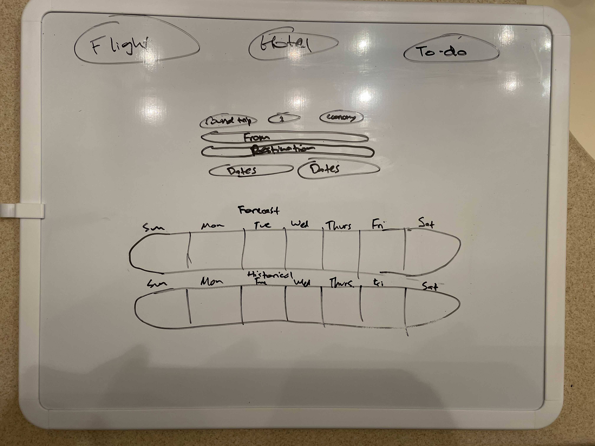

# Vacation Planner

## <u>Project Description</u>
Vacation destination traveling app.

**AUDIENCE**:
Users who live in the greater seattle area and use SEA airport and are flying to a US based city

**PROBLEM**:
Users are always trying to find their next vacation spot. However, they have to scour the web and/or open many websites and go through many web portals to find the information they are looking for.

**PRODUCT SOLUTION**:
Our product is an application where you can see everything in one central window. When booking, you'll be able to see the forcasted weather, book a hotel and flight, and depending on the city chosen, an iternary suggestion will appear.

**MVP FEATURES**:
* Weather of the city traveling to
* Hotels available:
    * Price range hotels
* Flight options:
    * Price range for flight
    * Times
* Tourist attractions
    * Iternary suggestions

**FUTURE DEVELOPMENT**:
* Seating arrangements on plane
    * Boarding Classes
* Number of rooms when booking hotel

## <u>User Story</u>
Who are we building this for?
AS A **frequent flyer**

What is the user trying to achieve?
I WANT **the experience of booking a flight all in one window/area AND know a prediction of the weather that week**

Why do they want to achieve this?
SO THAT **I can save time, and recall what I need from one place**

## <u>Wireframe or sketch of design</u>

## <u>API's to use</u>
* [Weather_API] https://www.meteomatics.com/en/api/getting-started/
* [Airfare_&_Hotel_API] https://developers.amadeus.com/self-service/apis-docs/guides/pagination-264
* [Destination_Content_API] https://developers.amadeus.com/self-service/category/destination-content/api-doc/points-of-interest

## <u>Rough Breakdown of tasks</u>
* Implement weather forecast from HW6
* Use Hotel API's and create a hotel booking interface
* Use airfare API's and create a flight booking interface
* Depending on the users flight destination, use certain destination content API's to make suggestions of top tourist attractions
